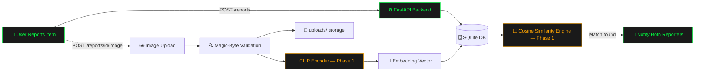

<div align="center">

[](https://git.io/typing-svg)

### *A campus lost & found system that actually finds things — using computer vision, not vibes.*

<br>


<br>

  

</div>

<br>

<div align="center">

### 📚 Table of Contents

<table>
<tr>
<td align="center">🎯<br><a href="#-the-problem">The Problem</a></td>
<td align="center">⚡<br><a href="#-features">Features</a></td>
<td align="center">🏗️<br><a href="#-architecture">Architecture</a></td>
<td align="center">🛠️<br><a href="#-tech-stack">Tech Stack</a></td>
</tr>
<tr>
<td align="center">📡<br><a href="#-api-reference">API</a></td>
<td align="center">🚀<br><a href="#-getting-started">Setup</a></td>
<td align="center">🗺️<br><a href="#-roadmap">Roadmap</a></td>
<td align="center">🧪<br><a href="#-testing">Testing</a></td>
</tr>
</table>

</div>

<br>

---

<div align="center">

## 🎯 THE PROBLEM

<table>
<tr>
<td width="33%" align="center">📦<br><b>The Cardboard Box</b><br><sub>Sits in the security office.<br>Nobody checks it. Ever.</sub></td>
<td width="33%" align="center">💬<br><b>The WhatsApp Graveyard</b><br><sub>200+ messages deep.<br>Unreadable by message 40.</sub></td>
<td width="33%" align="center">🕳️<br><b>The Missing Link</b><br><sub>"Lost near Auditorium" never<br>meets "Found near Main Gate."</sub></td>
</tr>
</table>

<br>

**Eye of Odin replaces all three with one system: report it, and let vision embeddings do the matching a human would take days to do by scrolling.**

</div>

---

<div align="center">

## ⚡ FEATURES

</div>

<table width="100%">
<tr><th align="left" width="80">Status</th><th align="left">Feature</th></tr>
<tr><td>✅</td><td>FastAPI backend with <b>locked, validated schema</b> (category, location zone, type, status)</td></tr>
<tr><td>✅</td><td>Full <b>CRUD</b> — create, list, filter, retrieve, and update lost/found reports</td></tr>
<tr><td>✅</td><td>Image upload with <b>magic-byte validation</b> — not just trusting file extensions like an amateur</td></tr>
<tr><td>✅</td><td><b>Overwrite-safe</b> image handling — no orphaned files rotting on disk</td></tr>
<tr><td>✅</td><td><b>20-test suite</b> covering validation, edge cases, filtering, and data integrity</td></tr>
<tr><td>🔜</td><td>CLIP embedding generation on report creation</td></tr>
<tr><td>🔜</td><td>Cosine similarity matching engine — auto-suggest "is this your item?"</td></tr>
<tr><td>🔜</td><td>Match confidence scoring + notification on likely match</td></tr>
<tr><td>🔜</td><td>Frontend UI for report submission and match review</td></tr>
</table>

---

<div align="center">

## 🏗️ ARCHITECTURE

</div>



<div align="center">
<sub><b>Report pipeline</b> — structured intake of every lost/found submission &nbsp;|&nbsp; <b>Matching engine</b> — CLIP embeddings + cosine similarity for automatic recognition</sub>
</div>

---

<div align="center">

## 🛠️ TECH STACK


<table>
<tr><th>Layer</th><th>Technology</th></tr>
<tr><td>Backend Framework</td><td>FastAPI</td></tr>
<tr><td>Database</td><td>SQLite + SQLAlchemy ORM</td></tr>
<tr><td>Validation</td><td>Pydantic</td></tr>
<tr><td>Vision Model</td><td>OpenAI CLIP <i>(Phase 1)</i></td></tr>
<tr><td>Similarity Matching</td><td>Cosine Similarity <i>(Phase 1)</i></td></tr>
<tr><td>Testing</td><td>Pytest + FastAPI TestClient</td></tr>
<tr><td>Frontend</td><td><code>[TBD — plug in your stack here]</code></td></tr>
</table>

</div>

---

<div align="center">

## 📡 API REFERENCE

</div>

<details open>
<summary><b>🔹 POST /reports</b> — Create a lost or found report</summary>
<br>

`status` defaults to `open`. Returns `201` + the created object as JSON.

</details>

<details>
<summary><b>🔹 GET /reports</b> — List all reports</summary>
<br>

Optional `?type=lost` or `?type=found` filter. Returns a JSON array.

</details>

<details>
<summary><b>🔹 GET /reports/{id}</b> — Retrieve a single report</summary>
<br>

Returns single JSON object. `404` if not found.

</details>

<details>
<summary><b>🔹 POST /reports/{id}/image</b> — Upload an item image</summary>
<br>

Validated by file content (magic bytes), not extension.

</details>

<details>
<summary><b>🔹 GET /uploads/{filename}</b> — Serve uploaded item images</summary>
<br>

Static file serving for stored report images.

</details>

<br>

<div align="center">

**Locked category values**

`bag` `electronics` `id_card` `bottle` `keys` `clothing` `book` `other`

**Locked location zones**

`Engineering Block` `Library` `Cafeteria` `Hostel A` `Hostel B` `Sports Complex` `Main Gate` `Admin Block` `Auditorium` `Other`

</div>

---

<div align="center">

## 🚀 GETTING STARTED

</div>

**Prerequisites:** Python 3.10+, pip

```bash
# Clone the repo
git clone https://github.com/venkataramavinaybandla-crypto/eye-of-odin.git
cd eye-of-odin

# Set up virtual environment
python -m venv venv
source venv/bin/activate   # Windows: venv\Scripts\activate

# Install dependencies
pip install -r requirements.txt

# Run the server
uvicorn main:app --reload
```

<div align="center">

🌐 API live at `http://127.0.0.1:8000` &nbsp;|&nbsp; 📖 Interactive docs at `http://127.0.0.1:8000/docs`

</div>

### Running Tests

```bash
pytest -v
```

<div align="center">


</div>

---

<div align="center">

## 📁 PROJECT STRUCTURE

</div>

```
eye-of-odin/
├── main.py              # FastAPI app + route definitions
├── models.py            # SQLAlchemy Report model
├── database.py          # DB session + connection config
├── schemas.py           # Pydantic request/response validation
├── test_main.py         # 20-test pytest suite
├── uploads/              # Uploaded item images
└── requirements.txt
```

---

<div align="center">

## 🗺️ ROADMAP

<table>
<tr><td align="left"><b>Phase 0</b> — CRUD backend, validation, image handling, full test coverage</td><td></td></tr>
<tr><td align="left"><b>Phase 1</b> — CLIP embedding generation on report creation</td><td></td></tr>
<tr><td align="left"><b>Phase 2</b> — Cosine similarity matching engine + confidence scoring</td><td></td></tr>
<tr><td align="left"><b>Phase 3</b> — Frontend for reporting + reviewing suggested matches</td><td></td></tr>
<tr><td align="left"><b>Phase 4</b> — Notification system for confirmed/likely matches</td><td></td></tr>
</table>

</div>

---

<div align="center">

## 🧪 TESTING

</div>

<table>
<tr><td align="center">✅<br><b>Validation</b><br><sub>invalid categories, zones,<br>types, malformed IDs</sub></td>
<td align="center">🖼️<br><b>Image Upload</b><br><sub>nonexistent reports, overwrites,<br>non-image files</sub></td>
<td align="center">🔍<br><b>Filtering</b><br><sub>empty results, invalid filters,<br>unfiltered queries</sub></td>
<td align="center">🔗<br><b>Data Integrity</b><br><sub>field round-tripping,<br>default status, timestamps</sub></td>
<td align="center">🧬<br><b>Embeddings</b><br><sub>locked as null,<br>pending Phase 1</sub></td>
</tr>
</table>

<div align="center">
<sub>All tests use real HTTP calls via <code>TestClient</code> — no mocked internals.</sub>
</div>

---

<div align="center">

## 🤝 CONTRIBUTING

This started as a simple Brainstorming activity which was actually growing and turned into a Backend Course Project.
Issues and PRs welcome — especially if you've got opinions on CLIP model selection or similarity thresholds for Phase 1.


</div>

---

<div align="center">

## 📄 LICENSE

`[MIT — or swap in whatever you're actually using]`

<br><br>

**Built by Team 17** — because lost & found shouldn't require faith in a WhatsApp group.

</div>
